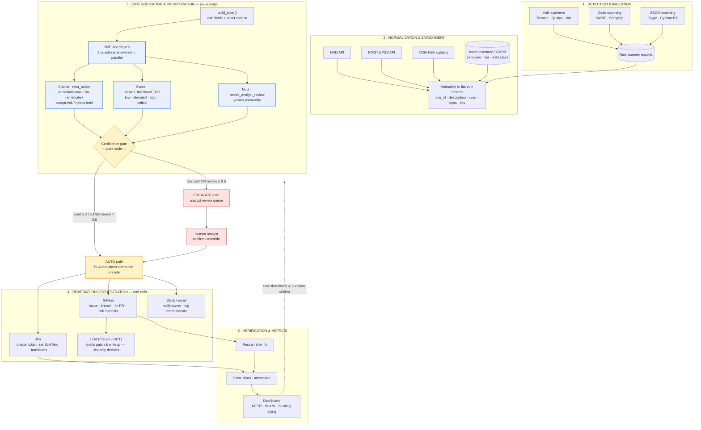
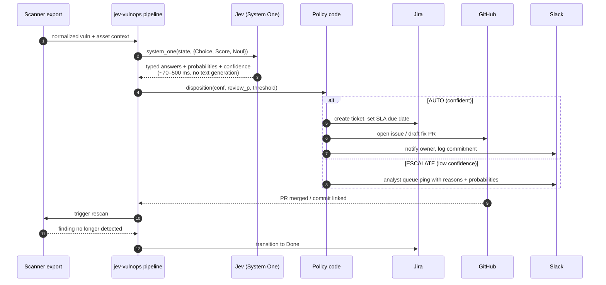

# End-to-end vulnerability management with Jev

Where the System One model sits in a full detect → triage → remediate → verify
loop, and which parts are model decisions vs. plain code vs. other tools.

## 1 · Architecture

## 2 · One triage request, end to end

## How to read it

**Phases 1–2 are plumbing, not AI.** Scanners emit heterogeneous exports; a
normalizer flattens them into the records this repo consumes
(`data/sample_scan.json` shape) and enriches them with EPSS scores, KEV
membership, and asset context from the CMDB. Asset context is the key input
Jev can't know on its own — the same CVE on an exposed tier-0 asset and an
internal tier-3 asset must come out differently.

**Phase 3 is where Jev lives.** One request per vuln carries all three
questions; answers come back typed with probabilities in ~70–500 ms. The
*gate is code, not model*: confidence thresholds, SLA day math, and the
escalate-vs-auto rule live in `pipeline.disposition()`. That's deliberate —
Jev is documented to be unreliable at arithmetic and dates, so numbers stay
out of the model and in the surrounding code.

**Phase 4 is tool calls.** Once the decision is made, ordinary integrations
do the work: Jira tickets with SLA fields, GitHub issues/PRs, Slack
notifications with logged commitments. Note the division of labor: **Jev
decides, an LLM writes.** Patch drafts and ticket prose need text generation,
which Jev explicitly doesn't do — so a Claude/GPT call handles that, while
Jev's calibrated probability decides *whether* it's worth doing at all.

**Phase 5 closes the loop.** A merged PR triggers a rescan; a clean rescan
closes the ticket; MTTR/SLA metrics feed back into threshold and question
tuning. Escalated items go to a human with the full probability distributions
attached (`--verbose` output), so the review is fast and auditable.

**Mapping to your existing projects:** this repo (`jev-vulnops`) is phase 3;
`vulngent` is phases 4–5 (outreach, commitments, GitHub/Jira linking, ledger,
dashboards). A natural integration is vulngent's triage agent calling this
pipeline instead of an LLM for the decision step.
